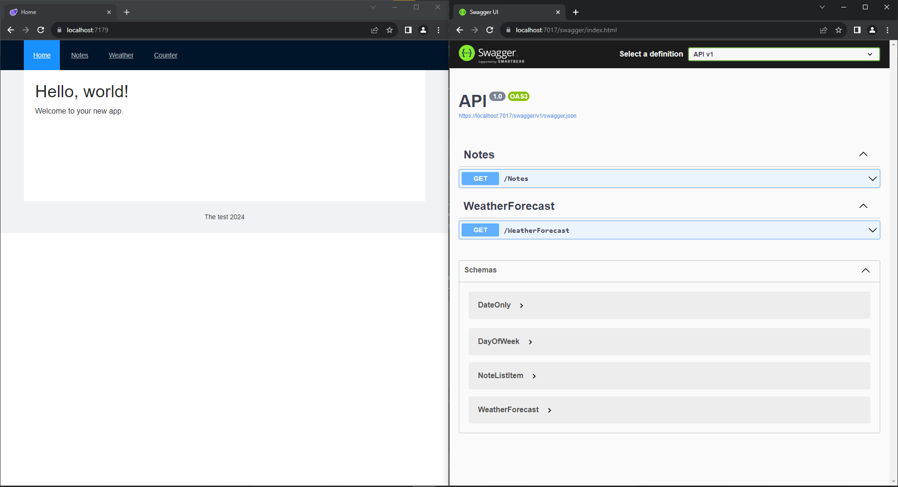

<pre>
  _______ _            _______ ______  _____ _______ 
 |__   __| |          |__   __|  ____|/ ____|__   __|
    | |  | |__   ___     | |  | |__  | (___    | |   
    | |  | '_ \ / _ \    | |  |  __|  \___ \   | |   
    | |  | | | |  __/    | |  | |____ ____) |  | |   
    |_|  |_| |_|\___|    |_|  |______|_____/   |_|  
</pre>

> A base for technical interviews

# 👋 Introduction

# 🔨 Setup

Because this is designed to be a basis for a technical interview the setup in itself is the not automated. 

But all steps are documented.

## Prerequisites

- [.net8 SDK](https://dotnet.microsoft.com/en-us/download/dotnet/8.0)
- [Visual Studio[^1]](https://visualstudio.microsoft.com/)
- [Docker](https://www.docker.com/)
- A generic database management tool[^2]

## Development environment setup

After the prerequisites are met we can start with setting up our development environment.

### Database engine setup

One thing that we will require is a database where all our persistent data will be stored. In order to make this as simple as possible we will use [postreSQL](https://www.postgresql.org/) running inside a docker image.

We can start the database with the following simple docker command:

```shell
docker run -d --name postgres16 -e POSTGRES_USER=sa -e POSTGRES_PASSWORD=Pass1234 -p 5432:5432 -v postgres16data:/var/lib/postgresql/data postgres:16
```

This will start a docker image locally on port 5432 with the following administrative user account:

|UserName|Password|
|---|---|
|sa|Pass123|

### Getting the code

There are some ways to go about this. You could:
- Download the repository
- Clone the repository

But the preferred way is to [fork](https://docs.github.com/en/pull-requests/collaborating-with-pull-requests/working-with-forks/fork-a-repo) the project.

Regardless of the method you should end up with the code locally on your system!

### Creating the database

With the database management tool of your choice connect to the database server and create a new database named __TheTest__.

> The _sa_ user must be permitted to access this new DB

One of the libraries used is [Entity Framework](https://learn.microsoft.com/en-us/aspnet/entity-framework) which enables us to easily _migrate_ an empty database to the state we need.

How exactly to do this can be found [>>here<<](https://learn.microsoft.com/en-us/ef/core/managing-schemas/migrations/?tabs=dotnet-core-cli), with the update procedure itself being explained [here](https://learn.microsoft.com/en-us/ef/core/managing-schemas/migrations/?tabs=dotnet-core-cli#create-your-database-and-schema)


## Pre flight check

Now that everything is on your system we can do a little preflight check.

The project in itself is a working solution with a:
- API and 
- UI

Opening the solution file in visual studio will give us to restore and build all parts of the application! 

`!!Do this now!!`

The compilation should complete with no errors.

When starting the application with the old trusty `F5` we should see the following picture:




# 📏 Technical evaluation

The nature of the evaluation done is up to the person doing the technical interview. So I can not give more than only a few ideas:

- You can add a complete new vertical of your choosing
- You can expand the weather sample to take data from the API
  - While doing that you can add real weather sources
- You can extend the notes vertical with CRUD methods
- You can concentrate on the part that is more relevant for the position
  - There is a lot of improvements to be done in the backend
    - Error handling
    - Logging
    - Transaction handling
    - ...
  - There is a log fo improvements possible in the frontend
    - Style corrections
    - Responsive design implementation
    - Data presentation
    - ...
- A QA can write tests scripts to test the existing application
- ...

# 🧹 Cleanup

## Database data removal

Because the database we used has to store data somewhere we had to create a docker volume to store it. Now that we are done we would like to remove that data from our system.

This is done by deleting the docker volume:

```sh
docker volume rm postgres16data
```

[^1]: Any version of Visual studio will do also the community edition
[^2]: Any tool will do but we had quite some success with [Dbeawer community](https://dbeaver.io/)